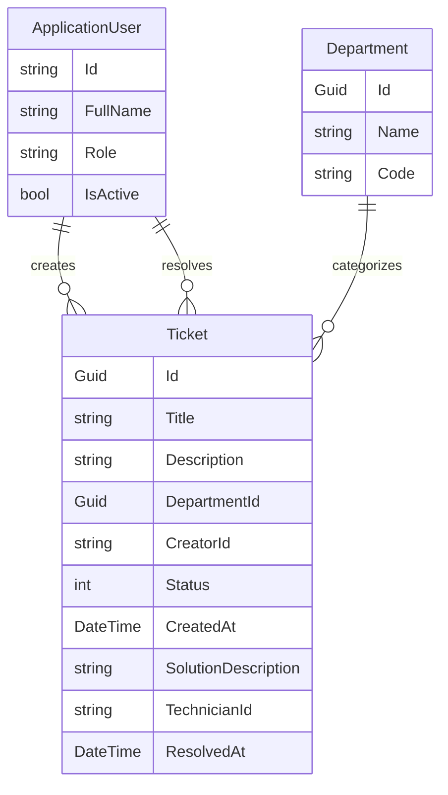

# Task Manager Backend

A robust task management backend built with .NET 10. This project follows a clean architecture approach, separating domain logic, infrastructure, and the API entry point.

## Project Structure

- **TaskManager.Api/**: The entry point of the application. Contains controllers, middleware, and configuration for the ASP.NET Core Web API.
- **TaskManager.Core/**: The Domain Layer. Contains domain entities, enums, DTOs, and business logic interfaces.
- **TaskManager.Infrastructure/**: The Data Layer. Implements data persistence with Entity Framework Core, manages ASP.NET Core Identity, and handles external service integrations.
- **TaskManager.Tests/**: Unit and integration tests to ensure code quality.

## Domain Model

### Entity-Relationship Diagram


### Entities
- **ApplicationUser**: Extends `IdentityUser` to include `FullName`, `Role` (Admin, Technician, Member), and `IsActive` status.
- **Department**: Represents organizational units (e.g., IT, HR) identified by a `Name` and a unique `Code`.
- **Ticket**: Represents a support request. It tracks the issue `Title`, `Description`, the assigned `Department`, the `Creator`, and the `Technician` who resolves it.

### Enums
- **TicketStatus**: `Open`, `Pending`, `Resolved`.
- **UserRole**: `Admin`, `Technician`, `Member`.

## Database Seeding

The system comes with a `DbInitializer` that seeds the following initial data:
- **Roles**: Admin, Technician, and Member.
- **Users**: Default accounts for each role (see "Default Credentials" section).
- **Departments**: 5 initial departments:
  - Human Resources (RRHH)
  - Information Technology (IT)
  - Sales (SALES)
  - Client Service (CS)
  - Management (MGMT)

## API Documentation

### High-Level Overview
The API provides the following main functional areas:
- **Authentication (`/api/Auth`)**: User registration, JWT-based login, and profile management.
- **User Management (`/api/Users`)**: Administrative controls for managing users and their roles.
- **Department Management (`/api/Departments`)**: CRUD operations for organizational departments.
- **Ticket Lifecycle (`/api/Tickets`)**: Creating, viewing, updating status, and resolving support tickets.

For detailed endpoint specifications, request/response bodies, and role requirements, see the [API Documentation](API_DOC.md).

## Tech Stack
- **Framework**: .NET 10 (ASP.NET Core)
- **Database**: PostgreSQL
- **ORM**: Entity Framework Core
- **Auth**: ASP.NET Core Identity (JWT)
- **Documentation**: OpenAPI (Scalar)

## Setup & Prerequisites

### Required Tools
- **.NET 10 SDK**: [Download .NET 10](https://dotnet.microsoft.com/download/dotnet/10.0)
- **PostgreSQL**: A running instance of PostgreSQL.
- **Docker** (Optional): For containerized execution.

### Installation
1.  **Clone the Repository**:
    ```bash
    git clone <repository-url>
    cd <repository-directory>/backend
    ```

2.  **Configuration**:
    Update `TaskManager.Api/appsettings.json` or use user-secrets to set your PostgreSQL connection string:
    ```json
    "ConnectionStrings": {
      "DefaultConnection": "Host=localhost;Database=taskmanager;Username=postgres;Password=yourpassword"
    }
    ```

3.  **Database Migrations**:
    Generate and apply migrations using the .NET EF tool:
    ```bash
    # Install tool if not present
    dotnet tool install --global dotnet-ef

    # Add initial migration
    dotnet ef migrations add InitialCreate --project TaskManager.Infrastructure --startup-project TaskManager.Api

    # Apply to database
    dotnet ef database update --project TaskManager.Infrastructure --startup-project TaskManager.Api
    ```

## Default Credentials

| Role | Email | Password |
| :--- | :--- | :--- |
| Admin | `admin@taskmanager.com` | `Admin123!` |
| Technician | `tech@taskmanager.com` | `Tech123!` |
| Member | `member@taskmanager.com` | `Member123!` |

## How to Run

### Using .NET CLI
From the `backend` directory:
```bash
dotnet run --project TaskManager.Api
```
Access the API documentation at `https://localhost:<port>/openapi/v1.json`.

### Using Docker
1.  **Build**:
    ```bash
    docker build -t taskmanager-backend .
    ```
2.  **Run**:
    ```bash
    docker run -it --rm -p 8080:8080 -e "ConnectionStrings__DefaultConnection=Host=host.docker.internal;..." taskmanager-backend
    ```

## License
This project is licensed under the MIT License.
